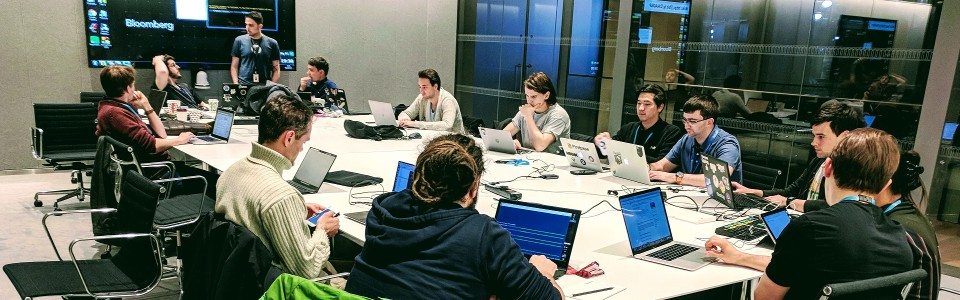

    <picture>
        <source srcset="../static/images/about/date-util-evening-session_480x150px.jpg 480w,
                        ../static/images/about/date-util-evening-session_960x300px.jpg 960w,
                        ../static/images/about/date-util-evening-session_1920x600px.jpg 1920w,
                        ../static/images/about/date-util-evening-session_3840x1200px.jpg 3840w"
                media="(orientation: landscape)"
                sizes="100vw">
        <source srcset="../static/images/about/date-util-evening-session_750x650px.jpg 750w,
                        ../static/images/about/date-util-evening-session_1650X1100px.jpg 1650w"
                media="(orientation: portrait)"
                sizes="100vw">
        
    </picture>
    

        

            <h1 class="chapter__page-title">{{ page.title }}</h1>
        

    

    

        

            <h2 class="chapter__section-title-left">Who We Are</h2>
            

                

                    
                    <h2 class="chapter__paragraph-title-dark">Python Sprints Decoded</h2>
                    

                    

                    Python Sprints is a non for profit group of like minded programmers who care chapter making open source projects better.
                    We believe in sharing our skills for free to earn our good karma. If you are devoted to a particular open source project, please let us know, we could make a sprint dedicated to it!
                    Inclusion is in the nature of our group and we want to make sure that no one is underrepresented. All people are welcome.
                    

                    <h2 class="chapter__paragraph-title-dark-left">How It Started</h2>
                    

                    

                        Our group was founded in October 2017. As all things in life the beginnings were humble with only a handful of people collaborating but the word quickly spread and now we have nearly 600 members and counting.
                    

                

            

        

    

